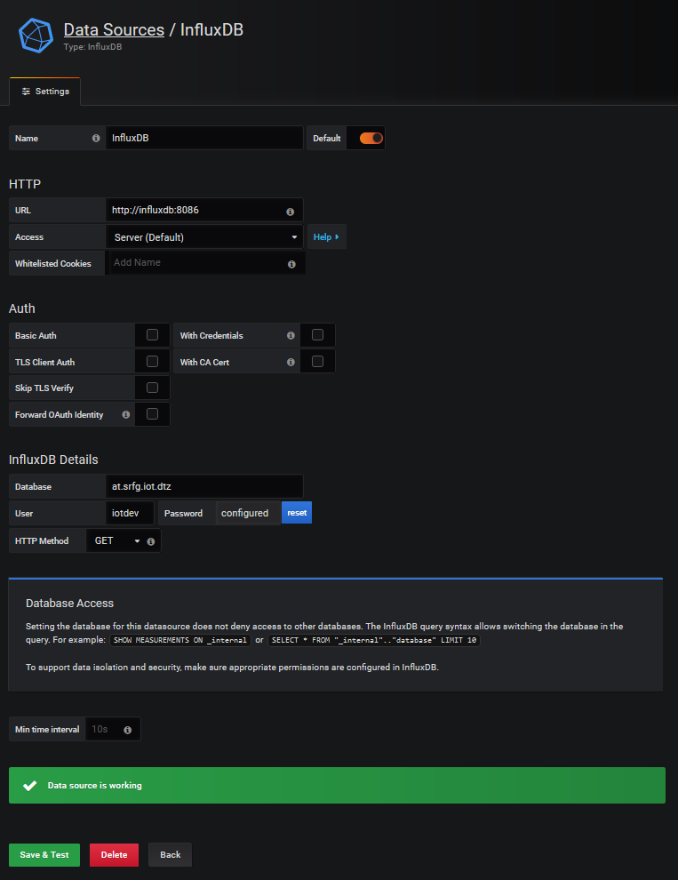

# DataStore

#### The DataStore is a provisioned backend with InfluxDB and Grafana that consumes streaming data from the system 'at.datahouse.Analytics.RoadAnalytics' of the Distribution-Network.

## Setup

All configurations are stored in the environment file `.env` in the directory `InfluxDB_Grafana`. 
Please create one if it doesn't exist.
**Change the password immediately and never commit this file if the service is available from other 
nodes!**

```.env
GRAFANA_PORT=30001
INFLUXDB_PORT=38601

VERBOSE_ADAPTER=true
INFLUXDB_HOST=at.srfg.Analytics.MachineAnalytics_influxdb

# Adapter configuration for the Distribution Network
CLIENT_NAME=analytics
SYSTEM_NAME=at.srfg.Analytics.MachineAnalytics
SERVER_URI=localhost:1908
KAFKA_BOOTSTRAP_SERVERS="iasset.salzburgresearch.at:9092"
ADAPTER_INFLUXDB_HOST=localhost
ADAPTER_INFLUXDB_PORT=38601

INFLUXDB_DB=at.srfg.Analytics.MachineAnalytics
INFLUXDB_ADMIN_ENABLED=true
INFLUXDB_ADMIN_USER=admin
INFLUXDB_ADMIN_PASSWORD=admin
INFLUXDB_USER=dev
INFLUXDB_USER_PASSWORD=dev

GF_SECURITY_ADMIN_USER=dev
GF_SECURITY_ADMIN_PASSWORD=dev
```

To start InfluxDB and also Grafana, run`
```bash
cd demo_applications/Analytics
docker-compose up --build -d
``` 

To investigate the services or 
to stop them, run:

```bash
docker-compose ps
docker-compose logs -f
docker-compose stop
```

## Adapter configuration

Datastreams that should be consumed can be configured in `influxdb-adapter/adapter/subscriptions.json`.
This config-file takes a list of global quantity names of the 
form `"domain.enterprise.work-center.station.quantity_name"` for global quantities and 
`"quantity_name"` for local (same-system) quantities.

```json
{
  "subscriptions": [
    "at.srfg.MachineFleet.*.temperature",
    "at.srfg.MachineFleet.*.acceleration",
    "local_network_utilization"
  ]
}
```  
Note that `"*"` is the wildcard-character that allows any instance of the hierarchy or quantity.


## First steps in InfluxDB

To validate, if InfluxDB is running correctly, curl the service 
using:

```bash
curl -sl -I http://localhost:38601/ping
# Expected result, note the status code 204
HTTP/1.1 204 No Content
Content-Type: application/json
Request-Id: 2f7091fb-9daa-11ea-8002-0242ac110002
X-Influxdb-Build: OSS
X-Influxdb-Version: 1.8.0
X-Request-Id: 2f7091fb-9daa-11ea-8002-0242ac110002
Date: Sun, 24 May 2020 10:34:45 GMT
```

InfluxDB provides a RestAPI that can be executed via `curl`

```bash
curl -XPOST 'http://localhost:38601/query' --data-urlencode 'q=CREATE DATABASE "mydb"'
curl -XPOST 'http://localhost:38601/query?db=mydb' --data-urlencode 'q=SELECT * INTO "newmeas" FROM "mymeas"'
curl -G 'http://localhost:38601/query?db=mydb&pretty=true' --data-urlencode 'q=SELECT * FROM "mymeas"'

# or for this database:
curl -G 'http://localhost:38601/query?db=at.srfg.Analtics.MachineAnalytics' --data-urlencode 'q=SELECT * FROM "at.srfg.Analytic
s.MachineAnalytics"'
```

More API interface examples can be found [here](https://docs.influxdata.com/influxdb/v1.8/tools/api/).

It is important, that the attributes `time` and all `tags` are
the primary key and must be unique. Please avoid a high number of different values
for a InfluxDB tag, e.g., a secondary timestamp must not be set as a tag.

Test the Influx-Python API using `db_interface.py`.


## First steps in Grafana

Grafana is started with InfluxDB and is reachable on
[localhost:30001](http://localhost:30001).

For this instance a demo dashboard should be provided that is configured in 
`InfluxDB_Grafana/grafana_src`. 
The Dashboard may stored in a folder that is not shown in home. 
Just click on search and find in the `Provisioning`-folder the provided dashboard.

To create an new `InfluxDB` data source, 
click on `Configuration -> Data Sources -> Add data source`.
Then fill the fields as shown in this screenshot:

   

The password is set in the environment file `.env`.
As you can see in the green box, the test was successful!

Afterwards, a dashboard can be created that retrieves data from
InfluxDB. Therefore, click on `+ -> Dashboard` and then build a
dashboard from scratch. However, it is also possible to import
a dashboard that was previously exported. 
Note that there should already be a provisioned dashboard.


## Modifying the consumer adapter

The provided code-snippets follow a generic behaviour.
In order to adapt the code, it is useful to modify the adapter-script `influxdb-adapter/adapter/influxdb_adapter.py`.
It is useful to just start `InfluxDB` and `Grafana` by running `InfluxDB_Grafana/docker-compose.yml`
and the run the adapter-script in Python.
